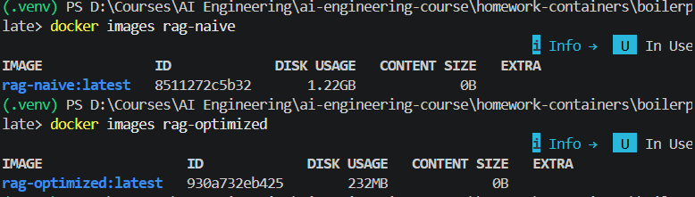
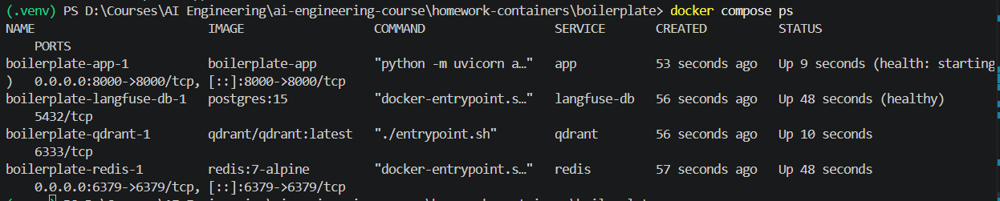
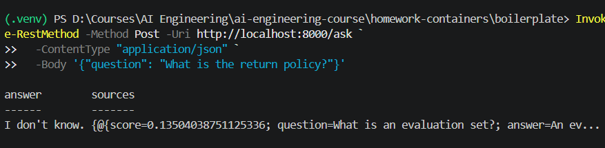

# Lesson 13 — Containerized RAG App

## How to run

```bash
cp .env.example .env   # add your OPENAI_API_KEY
docker compose up --build
```

Test the endpoint:

```bash
curl -X POST localhost:8000/ask \
  -H "Content-Type: application/json" \
  -d '{"question": "What is the return policy?"}'
```

## Image metrics

| Metric | Naive | Multi-stage | Improvement |
|---|---|---|---|
| Image size | 1.22 GB | 232 MB | **5.3x smaller** |
| Build time | 134 s | 9 s | **14.9x faster** |
| Rebuild after code change | 74 s | 5 s | **14.8x faster** |
| Cold start (to `/health=ok`) | 6.6 s | 8.1 s | 1.5s slower (negligible) |

## When to use each approach

### Use Naive Dockerfile for:
- ❌ **NOT recommended for production**
- Local development/learning only
- Educational purposes (understanding basics)

### Use Multi-stage (Optimized) for:
- ✅ **All production deployments**
- CI/CD pipelines (93% faster rebuilds)
- Container registries (81% less bandwidth)
- Kubernetes/orchestration systems
- Any shared infrastructure

→ **See [COMPARISON_REPORT.md](COMPARISON_REPORT.md) for detailed analysis**

## Key optimizations in multi-stage

1. **Python slim image** (900MB → 170MB base)
2. **Multi-stage build** (discards build tools, deps only at runtime)
3. **Non-root user** (security best practice)
4. **HEALTHCHECK** (container orchestration ready)
5. **Selective COPY** (only necessary files)

## Screenshots

### Docker images comparison


### Docker compose services running


### API endpoint response

